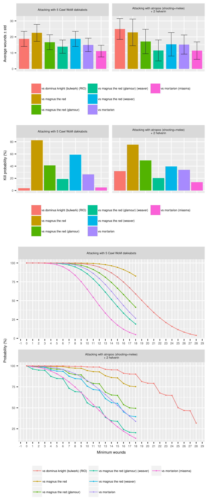

# The Warhammer 40,000 8th edition oracle

This library computes the exact probability distribution of pretty much any N
vs 1 facings in the game, including extra effects on certain dice rolls,
modifiers, psychic powers, charge rolls, auras and stratagems.

The following example produces a report comparing the damage output of 5
Kastelan robots within Belisarius Cawl's aura using Wrath of Mars and a
Cerastus Knight Atrapos (shooting and then charging) paired with two Armiger
Helverins.

First, import some data modules and the charting modules

```haskell
import W40K.Data.AdMech          as AdMech
import W40K.Data.DeathGuard      as DG
import W40K.Data.ImperialKnights as IK
import W40K.Data.ThousandSons    as TS

import W40K.Core.Chart
import W40K.Core.Chart.R (analysisToFile)
```


First, declare the targets to compare

```haskell
let targets = [
      TS.magnusModel,
      TS.glamourOfTzeentch TS.magnusModel,
      TS.weaverOfFates TS.magnusModel,
      TS.weaverOfFates (TS.glamourOfTzeentch TS.magnusModel),
      DG.mortarionModel,
      DG.miasmaOfPestilence DG.mortarionModel,
      IK.rotateIonShields (IK.ionBulwark IK.dominusModel)
    ]
```

Then, the attack sequences (turns). `GenericTurn` is a `Monoid` (by
interleaving phases), so they can be combined with `mconcat`:

```haskell
let attackers = [
      eraseTurn emptyTurn {
        turnName = "5 Cawl WoM dakkabots",
        turnShooting = \_ ->
          within AdMech.cawlAura $
            with AdMech.wrathOfMars $
              AdMech.dakkabots 5 AdMech.Protector
      },

      mconcat [
        eraseTurn emptyTurn {
          turnName = "atropos (shooting+melee)",
          turnShooting = \_ -> [IK.knightAtropos],
          turnMelee = \_ _ -> [IK.knightAtropos]
        },
        eraseTurn emptyTurn {
          turnName = "2 helverin",
          turnShooting = \_ -> two [IK.armigerHelverin]
        }
      ]
    ]
```

Finally, run the analysis and plot the result (if using the `ggplot2` backend, remember to run all these within `withEmbeddedR`):

```haskell
analysisToFile "readme-example.png"
    [
      -- For each attacker, a bar plot of the average number of wounds with error bars for the deviation
      AnalysisConfig ByAttacker WoundingSummary attackers targets,

      -- For each attacker, a bar plot of the probability of killing the target
      AnalysisConfig ByAttacker ProbKillOne attackers targets,

      -- For each attacker, a chart of the probability of inflicting (at least) each number of wounds
      AnalysisConfig ByAttacker (NumWoundsMax RevDistributionPlot) attackers targets
    ]
```

Result:




For more examples, see [Main.hs](cli/Main.hs).
